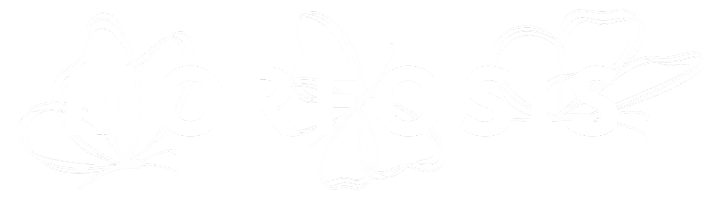

    

<h1 align = "center">
  <b>Morfosis: Tecnología Criptográfica para los Derechos Humanos</b>
</h1>

Kevin Martínez, Mateo Zepeda, Raúl Correa, Julio Jaramillo, Juan José H. Beltrán

## Introducción

 Morfosis es una plataforma para la gestión segura de documentos de la organización a través de firmas digitales y otras herramientas criptográficas. Se ejecuta principalmmente a través de Microsoft Power Apps, apoyada de otras herramientas como Azure SQL, Azure Functions, Blob Storage y Power Automate. 

