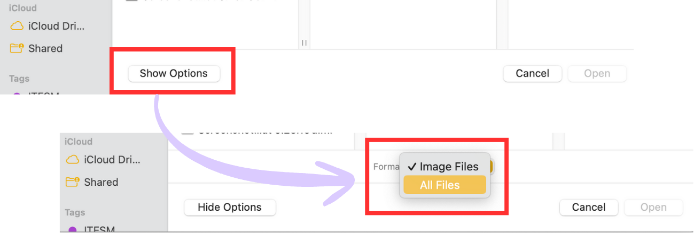
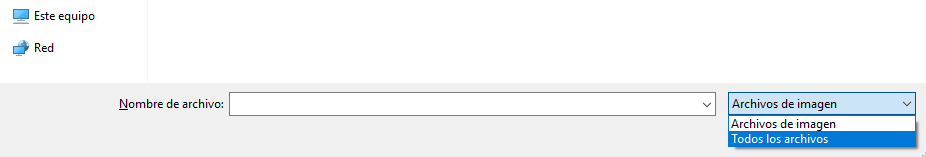

# Creación de Flujos

Los flujos hacen referencia a un documento específico que sigue una ruta determinada. Al inicio del flujo el documento se encuentra sin firma; mientras que al final del mismo, el documento ya fue firmado por todos los usuarios de la ruta seleccionada.

Un detalle a considerar es que **el archivo ingresado únicamente puede ser de tipo pdf**, es importante tener cuidado de no ingresar archivos .docs o cualquier otra extensión, ya que esto causaría un error al intentar firmarlo.

Para crear un flujo se siguen los siguientes pasos:
1. Ir a la pantalla de creación de flujos.

    

2. Escribir el nombre del flujo y el área principal de la que forma parte.
3. Seleccionar el documento que se desea firmar. Debido a limitaciones de PowerApp, el selector de archivos muestra inicialmente sólo archivos de tipo imagen, por lo que para seleccionar archivos .pdf es necesario cambiar el formato a "todos los archivos", tras lo cual se selcciona el documento deseado.

* En MacOs:

  

    
  

* En Windows:

  

    
  

5. Seleccionar la ruta que se desea que siga el documento. Al seleccionar una ruta, los firmantes aparecerán a la derecha. El orden que seguirá el documento es de arriba a abajo.

   

    
  

### Autofirmado
Existe una ruta predeterminada llamada Autofirmado, la cual permite firmar el documento con la firma de la cuenta ingresada. Es posible acceder al documento firmado desde el historial.
