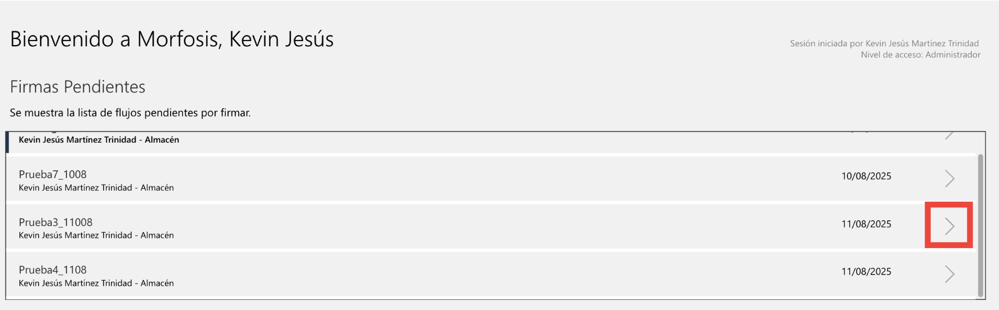

# Firmar y Rechazar Documentos

Al iniciar un nuevo flujo, el documento es firmado automáticamente por el creador del flujo. Tras esto, el documento a firmar aparecerá en la sección de "Firmas Pendientes" en la página de inicio del usuario siguiente en la ruta.

Para firmar o rechazar un documento se siguen los siguientes pasos:
1. Desde la página de inicio, dar click en la flecha del documento pendiente que se desea firmar.

    

  
3. Una vez en la página de firmado, dar click en firmar o rechazar documento.

Ya sea al firmar o al rechazar el documento, una notificación diferente será enviada al creador del flujo y al firmante siguiente.
